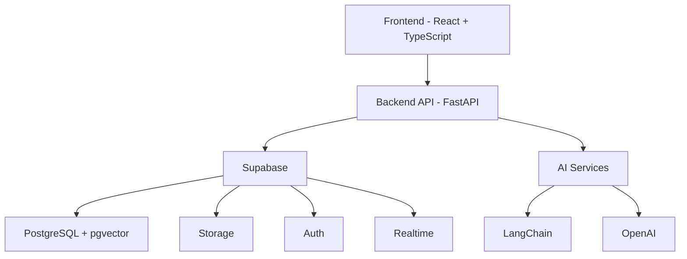

# 🚀 ClauseIQ - AI-Powered Contract Lifecycle Management

<div align="center">


[](https://reactjs.org/)
[](https://www.typescriptlang.org/)
[](https://fastapi.tiangolo.com/)
[](https://supabase.com/)
[](https://tailwindcss.com/)

</div>

## 📌 Overview

ClauseIQ is a modern, AI-augmented Contract Lifecycle Management (CLM) platform designed to streamline contract workflows for legal, procurement, and compliance teams. It combines intelligent automation with an intuitive user interface to simplify contract creation, negotiation, execution, and renewal processes.

### 🎯 Key Features

- **📄 Smart Contract Management**
  - Upload & version control (PDF, Word)
  - Role-based access control
  - Expiry/renewal reminders
  - Audit trail & compliance tracking

- **🤖 AI-Powered Features**
  - Automatic clause extraction
  - Risk term detection
  - Version comparison & diff analysis
  - Contract QA chatbot (RAG)

- **✍️ E-Signature Integration**
  - Secure electronic signing
  - Ordered signature workflow
  - Signature certificates
  - Audit logs

## 🏗️ Architecture



## 🛠️ Tech Stack

### Frontend
- Vite + React + TypeScript
- TailwindCSS for styling
- TanStack Query for data fetching
- React Router for navigation
- Zustand for state management
- Supabase Client SDK

### Backend
- FastAPI (Python 3.11+)
- Supabase for:
  - PostgreSQL + pgvector
  - Authentication & Authorization
  - File Storage
  - Realtime updates
- Celery + Redis for job queue

### AI/ML
- LangChain for orchestration
- OpenAI GPT-4/3.5 for:
  - Clause extraction
  - Risk assessment
  - Diff summarization
- text-embedding-3-small for RAG

## 🚀 Getting Started

### Prerequisites
- Node.js 18+
- Python 3.11+
- Redis (for job queue)

### Frontend Setup
```bash
# Navigate to client directory
cd client

# Install dependencies
npm install

# Start development server
npm run dev
```

### Backend Setup
```bash
# Navigate to server directory
cd server

# Create virtual environment
python -m venv venv

# Activate virtual environment
# Windows
.\venv\Scripts\activate
# Unix
source venv/bin/activate

# Install dependencies
pip install -r requirements.txt

# Start server
uvicorn main:app --reload
```

### Environment Variables

Create `.env` files in both `client` and `server` directories:

```env
# client/.env
VITE_SUPABASE_URL=your-supabase-url
VITE_SUPABASE_ANON_KEY=your-supabase-anon-key

# server/.env
SUPABASE_URL=your-supabase-url
SUPABASE_SERVICE_KEY=your-service-key
OPENAI_API_KEY=your-openai-key
REDIS_URL=your-redis-url
```

## 👥 User Roles

| Role | Permissions |
|------|-------------|
| Contract Manager (CM) | Upload, edit, invite, counter-sign |
| Authorized Signatory (AS) | Review, comment, sign |
| Contract Observer (CO) | Read-only access |

## 🔄 Contract Lifecycle

1. **Draft** - Upload & AI analysis
2. **Review** - Comments & revisions
3. **Sign** - Ordered signature collection
4. **Store** - Immutable storage & audit
5. **Monitor** - Expiry tracking & renewal

## 🎨 Design System

- **Colors**
  - Coral Primary (`#FF385C`) - Interactive accents
  - Ink Text (`#222222`) - Body text and icons
  - Cloud Background (`#F7F7F7`) - Page background

- **Layout**
  - Max-width: 1280px
  - Vertical rhythm: 24px
  - Mobile breakpoint: < 768px
  - Tablet breakpoint: < 1024px

## 🧠 AI Features

### 1. Clause Extraction
- Uses GPT-4 to identify key contract clauses
- Extracts and categorizes with confidence scores
- Highlights relevant text in PDF viewer

### 2. Risk Assessment
- Identifies high-risk terms and ambiguous language
- Color-coded severity indicators
- Provides mitigation recommendations

### 3. Version Comparison
- Generates human-readable diff summaries
- Side-by-side visual comparison
- Tracks changes across versions

### 4. Contract QA (RAG)
- Interactive chat interface
- Context-aware responses
- Source citations from contract text
- Daily token quota management

## 📱 Responsive Design

- Mobile-first approach
- Adaptive layouts for all screen sizes
- Touch-friendly interactions
- Bottom sheet navigation on mobile

## 🔒 Security Features

- Supabase Authentication
- Row Level Security (RLS)
- Secure file storage
- Audit logging
- Role-based access control

## 🚧 Development Guidelines

1. Follow TypeScript best practices
2. Use Tailwind for styling
3. Implement proper error handling
4. Write meaningful commit messages
5. Keep components small and focused
6. Add JSDoc comments for complex logic

## 📚 Available Scripts

### Frontend
- `npm run dev` - Start development server
- `npm run build` - Build for production
- `npm run lint` - Run ESLint
- `npm run preview` - Preview production build

### Backend
- `uvicorn main:app --reload` - Start development server
- `celery -A worker worker` - Start Celery worker
- `pytest` - Run tests

## 🤝 Contributing

1. Fork the repository
2. Create a feature branch
3. Commit your changes
4. Push to the branch
5. Open a pull request

## 📄 License

This project is licensed under the MIT License - see the [LICENSE](LICENSE) file for details.

## 🙏 Acknowledgments

- [Supabase](https://supabase.com/) for the amazing backend platform
- [OpenAI](https://openai.com/) for the powerful AI models
- [LangChain](https://www.langchain.com/) for AI orchestration
- [FastAPI](https://fastapi.tiangolo.com/) for the efficient backend framework

---

<div align="center">
Made with ❤️ by the ClauseIQ Team
</div> 
